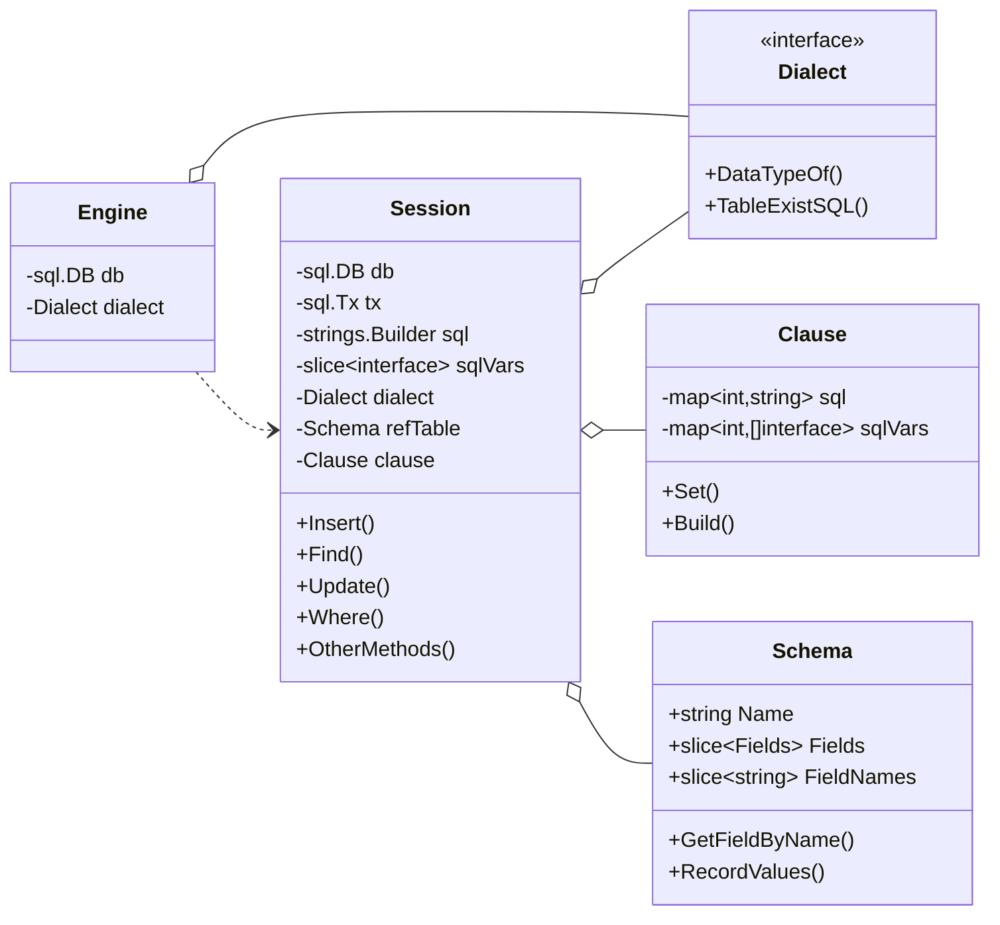

# ORM 框架 - FexORM

> 参考 [7 days golang programs from scratch](https://github.com/geektutu/7days-golang)

## 特性

- 屏蔽不同数据库的差异
- 表结构与对象结构的映射
- 链式构造 SQL 语句
- 支持 Hooks 扩展
- 支持事务

## 类图



## 相关工作

使用 database/sql 管理数据库连接
> `Open` 只是验证其参数格式是否正确，实际上并不创建与数据库的连接。如果要检查数据源的名称是否真实有效，应该调用`Ping`方法。
> 
> 返回的`sql.DB`是一个数据库（操作）句柄，它可以安全地被多个 goroutine 并发使用，并且维护其自己的空闲连接池。
> 
> 因此，`Open`函数应该仅被调用一次，很少需要关闭这个DB对象。
> 
> sql.DB还有两个方法：
> - `SetMaxOpenConns`：设置与数据库建立连接的最大数目。 如果n大于0且小于最大闲置连接数，会将最大闲置连接数减小到匹配最大开启连接数的限制。 如果n<=0，不会限制最大开启连接数，默认为0（无限制）。
> - `SetMaxIdleConns`：设置连接池中的最大闲置连接数。 如果n大于最大开启连接数，则新的最大闲置连接数会减小到匹配最大开启连接数的限制。 如果n<=0，不会保留闲置连接。

> 使用 `sql.Open()` 连接数据库，第一个参数是驱动名称，第二个参数是数据库的名称，对于 SQLite 来说，也就是文件名，不存在会新建。返回一个 sql.DB 实例的指针。
> 
> `Exec()` 用于执行 SQL 语句，如果是查询语句，不会返回相关的记录。所以查询语句通常使用 `Query()` 和 `QueryRow()`，前者可以返回多条记录，后者只返回一条记录。
> 
> `Exec()`、`Query()`、`QueryRow()` 接受1或多个入参，第一个入参是 SQL 语句，后面的入参是 SQL 语句中的占位符 `?` 对应的值，占位符一般用来防 **SQL 注入**。
> 
> `QueryRow()` 的返回值类型是 `*sql.Row`，`row.Scan()` 接受1或多个指针作为参数，可以获取对应列(column)的值。


## 使用多模块工作区进行开发

1. 在工作区目录下执行下面的命令，会创建 `go.work`文件
    ```
    go work init ./demo
    ```

2. 在工作区中添加其他模块
    ```
    go work use ./fexorm
    ```

3. 通过此方法调用同一工作区下的其他模块。执行 example 模块：
    ```
    go run github.com/felixorbit/fexorm
    ```